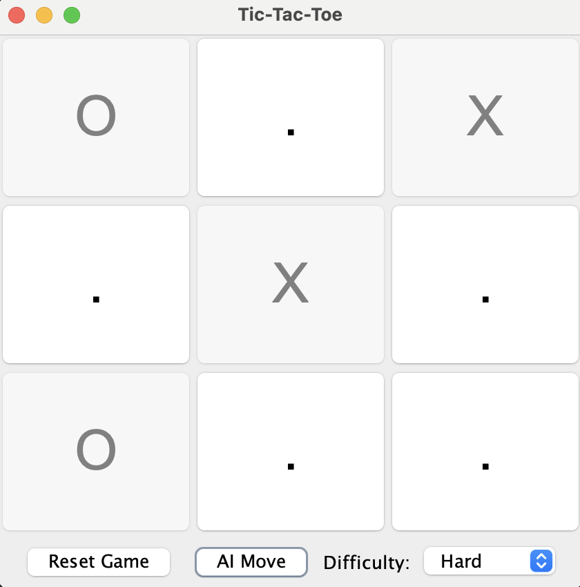
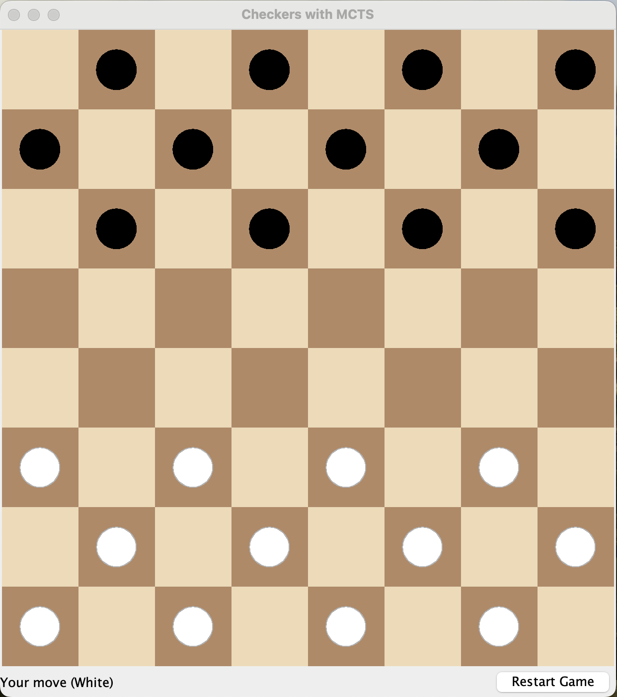

# 🎮 Monte Carlo Tree Search Games – TicTacToe & Checkers

This project implements **TicTacToe** and **Checkers** using the **Monte Carlo Tree Search (MCTS)** algorithm. It includes complete game logic, a GUI built with Java Swing, benchmarking tools, and analysis of performance based on iteration counts.

---

## 📌 Features

### ✅ Common (Both Games)
- Implemented using Java
- MCTS-based AI opponent
- Java Swing-based user interface
- Benchmarking tools to measure performance
- Deterministic randomness for reproducible tests

### 🎯 TicTacToe
- 3x3 board game
- Player X (human) vs Player O (AI)
- Supports difficulty levels:
    - Easy: Random
    - Medium: Blocking & Winning Heuristics
    - Hard: MCTS-based
- Terminal state detection (win/draw)
- Full unit test coverage

### ♟️ Checkers
- Standard 8x8 board (playable on black tiles only)
- Player White (human) vs Player Black (AI)
- Movement: Forward diagonal moves
- Game ends if no valid moves or no pieces remain
- MCTS AI for decision-making

---

## 🧠 Monte Carlo Tree Search (MCTS)

- **Selection:** Uses UCB1 for balancing exploration vs exploitation
- **Simulation:** Runs random playouts from current state
- **Expansion:** Adds new nodes for unexplored moves
- **Backpropagation:** Updates statistics after simulation
- **Iterative Deepening:** Benchmarked with 100–1600 iterations

---

## 📊 Benchmarking Observations

### TicTacToe
- Player X dominates at low iterations (100–800)
- All games draw at 1600 iterations (optimal play)
- Player 0 (AI) has no wins at lower levels
- Computation time increases with more iterations

### Checkers
- White wins slightly more overall
- Players are balanced in performance
- Draws occur only at higher iteration levels
- Computation time grows significantly as iterations increase

### 📊 Observation Charts

- [TicTacToe Observation Sheet](https://docs.google.com/spreadsheets/d/15P8nzy6nSBB7ojTekfV9zSdQAPnChz-LFBRZZ_vc7AY/edit?usp=sharing)
- [Checkers Observation Sheet](https://northeastern-my.sharepoint.com/:x:/g/personal/pratapwar_s_northeastern_edu/EZXoJ7LxvjdFrQ24QRFvO_4BEfURCLdWyIEk1pBd-1Xi9Q?e=gXWAKm)

---

## 🚀 How to Run

### 1. Clone the Repository
```bash
git clone https://github.com/PSA-Final-Project/PSA-Final-Project
```

### 2. 📂 Open the Project

Open the project in your preferred Java IDE (e.g., IntelliJ, Eclipse, NetBeans)

---

### 3. ▶️ Running TicTacToe

- **GUI:** Run  
  `src/main/java/com/phasmidsoftware/dsaipg/projects/mcts/tictactoe/TicTacToeGUI.java`

- **Benchmarking Tool:** Run  
  `src/main/java/com/phasmidsoftware/dsaipg/projects/mcts/tictactoe/TicTacToeBenchmark.java`

### TicTacToe UI Preview

[//]: # ()
<p align="center">
  
</p>

---

### 4. ▶️ Running Checkers

- **GUI:** Run  
  `src/main/java/com/phasmidsoftware/dsaipg/projects/mcts/checkers/CheckersGUI.java`

- **Benchmarking Tool:** Run  
  `src/main/java/com/phasmidsoftware/dsaipg/projects/mcts/checkers/CheckersBenchmark.java`

### Checkers UI Preview
<p align="center">
  
</p>

[//]: # ()

> ⚠️ **Note:** Make sure Java **23+** is installed and set as the project SDK.

---

### 5. 🎥 Demo Videos

### 🎮 TicTacToe Gameplay Demo

<a href="https://drive.google.com/file/d/1WMXLxa9RBpvCWiPqA28i4Ky-aIyIm2lP/view?usp=sharing" target="_blank">
  
</a>

### 🎮 Checkers Gameplay Demo

<a href="https://drive.google.com/file/d/10dpuRsVw5TFtEp0RZFBaC0HuPaaieLvK/view?usp=drive_link" target="_blank">
  
</a>

---

## 📄 Final Project Report

You can view the complete report here:  
[📘 PSA Final Report (PDF)](report/PSA_FinalProject_Report.pdf)

### 👨‍💻 Contributors

- **Shreya Wanisha** (<wanisha.s@northeastern.edu>)
- **Shriya Pratapwar** (<pratapwar.s@northeastern.edu>)
- **Dharana Kashyap** (<kashyap.dh@northeastern.edu>)
